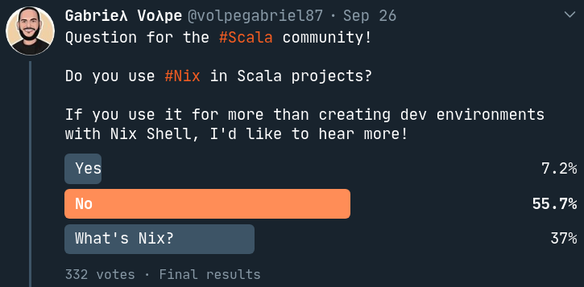
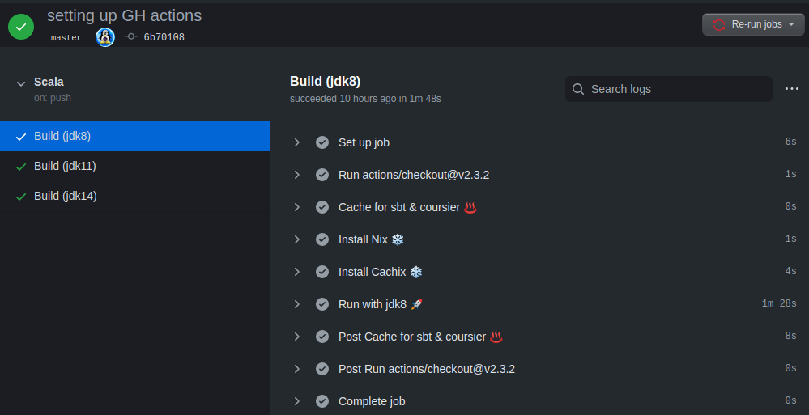

# sbt-nix.g8

Get started with Nix and see how you can benefit from it in your Scala or cross-team projects.

<!--ts-->
* [Motivation](#motivation)
* [What is Nix?](#what-is-nix)
* [Install Nix](#install-nix)
* [Use cases](#use-cases)
   * [Reproducible development shell](#reproducible-development-shell)
   * [Reproducible CI builds](#reproducible-ci-builds)
   * [Reproducible (and smaller) Docker images](#reproducible-and-smaller-docker-images)
      * [Default Docker image using sbt-native-packager](#default-docker-image-using-sbt-native-packager)
      * [Custom Nix Docker image using sbt-native-packager](#custom-nix-docker-image-using-sbt-native-packager)
      * [Custom Nix Docker image using sbt-assembly](#custom-nix-docker-image-using-sbt-assembly)
      * [Docker images](#docker-images)
* [Pinning Nixpkgs](#pinning-nixpkgs)
   * [Using sbt with a different JDK](#using-sbt-with-a-different-jdk)
* [Caching sbt derivations](#caching-sbt-derivations)
* [Managing dependencies (jars) with Nix](#managing-dependencies-jars-with-nix)
   * [sbt-derivation](#sbt-derivation)
* [Get started with sbt-nix.g8](#get-started-with-sbt-nixg8)

<!-- Added by: gvolpe, at: Fri 02 Oct 2020 03:04:04 PM CEST -->

<!--te-->

## Motivation

I started out writing this guide with examples after I ran a Twitter poll on September 2020.



The results speak for themselves but **I am on a mission to change the current situation** because I believe Nix and functional programming are the way forward. If you would like to help, share this guide with as many people as you can, give it a ⭐ and spread the good word!

## What is Nix?

Quoting the [official website](https://nixos.org/):

> A powerful package manager for Linux and other Unix systems that makes package management reliable and reproducible. Share your development and build environments across different machines.

*Reproducibility* is probably the best feature Nix has to offer. It is widely used in other ecosystems, such as Haskell, Python, Rust and Go, but barely used (and known) in the Scala community.

## Install Nix

You are only a command away (unless you are on NixOS), as [officially documented](https://nixos.org/download.html).

```
curl -L https://nixos.org/nix/install | sh
```

## Use cases

There are three clear use cases where I think Nix can make a difference in Scala projects.

### Reproducible development shell

All the project's dependencies are declared in a `shell.nix` file. For example, `jdk`, `sbt` and `coursier` (maybe also  `jekyll`, if a microsite depends on it).

```nix
{ jdk ? "jdk11" }:

let
  pkgs = import ./pkgs.nix { inherit jdk; };
in
  pkgs.mkShell {
    buildInputs = [
      pkgs.coursier
      pkgs.${jdk}
      pkgs.sbt
    ];
  }
```

Where `pkgs.nix` defines an *exact* version of the Nixpkgs (more on this [later](#pinning-nixpkgs)). The important part is that every member of the team will have access to the exact same packages.

**Avoid global installation of Java, Sbt & any other binary**

> Instead of installing binaries from the web, let Nix manage your dependencies. This is crucial when working in big teams. We will no longer hear "it compiles on my machine".

The benefit is even greater when you work on diverse teams where everybody shares the same `shell.nix` to run the full application. For example, at work we declare all the dependencies for frontend, backend and infrastructure such as `jdk`, `nodejs` and `kubectl`, among others.

It is very appealing for new members joining the team! On day one, all they need to do is to git-clone the project, install Nix, run `nix-shell` and all the project's dependencies will become available. Isn't that great?

We can also use [nix-direnv](https://github.com/nix-community/nix-direnv) so that we don't even need to run `nix-shell` every time. Upon entering a working directory with a `shell.nix`, all the declared software will become automatically available. Feels like magic! Actually, this is what we promote using at work.

### Reproducible CI builds

We can use the exact same dependencies declared in `shell.nix` on the CI build. No more discrepancies.



Have a look at [.github/workflows/ci.yml](.github/workflows/ci.yml) to see how it looks like. It couldn't be simpler!

In fairness, we use `nix/ci.nix` to run the CI build, which is a version of `shell.nix` that only contains the `sbt` package. The idea is that we can keep adding packages to our `shell.nix` for local development, and there might be stuff we don't need at all in the CI, so it will run faster with less dependencies to pull.

### Reproducible (and smaller) Docker images

Nowadays, most Scala projects are deployed as a Docker image (sometimes using Kubernetes). Although there are tools such as `sbt-native-packager`, we can again declare what dependencies make it to our Docker image. There are some immediate benefits in doing this:

- we get to use the exact same JDK / JRE we declare in our Nix file.
- we will more likely get a smaller image than using a base slim one from Docker Hub.
- we will have a reproducible image (no more `apt-get update`s, please!).

We can still use `sbt-native-packaer` to create our Docker images, as demonstrated in the examples below. Another option is to use `sbt-assembly` and some declarative definition of our Dockerfile.

Note: the three examples shown below can be found under the `modules` folder. Feel free to clone the repo and play around with them.

#### Default Docker image using sbt-native-packager

This module shows how users normally use `sbt-native-packager` to create Docker images. It uses `openjdk:11.0.8-jre-slim` as the base Docker image.

```
sbt "sbt-nix-native-default/docker:publishLocal"
docker run -it sbt-nix-bootstrap-default:0.1.0-SNAPSHOT
```

Here's the resulting Docker image, including the jar dependencies declared in our `build.sbt`.

```
REPOSITORY                  TAG                            IMAGE ID            CREATED             SIZE
sbt-nix-bootstrap-default   0.1.0-SNAPSHOT                 c0320ed1b643        2 minutes ago       221MB
```

This is the default and *it doesn't use Nix at all*.

#### Custom Nix Docker image using sbt-native-packager

We could benefit from Nix by creating a base Docker image using the *exact same `jre`* we declare in our project, and still use `sbt-native-packager` to make the final image.

```nix
{ imgName ? "base-jre"
, jdk ? "jdk11"
, jre ? "adoptopenjdk-jre-openj9-bin-11"
}:

let
  pkgs = import ./pkgs.nix { inherit jdk; };
in
  pkgs.dockerTools.buildLayeredImage {
    name      = imgName;
    tag       = "latest";
    contents  = [ pkgs.${jre} ];
  }
```

Note: We are using `adoptopenjdk-jre-openj9-bin-11` here whereas for the default image we use `openjdk:11.0.8-jre-slim` but really, I couldn't find an image for the same JRE on Docker Hub, only for the JDK (if you do please let me know to update the document).

Run it as follows:

```
nix-build nix/docker.nix -o result-base-jre
docker load -i result-base-jre
sbt "sbt-nix-native-custom/docker:publishLocal"
docker run -it sbt-nix-bootstrap-custom:0.1.0-SNAPSHOT
```

The resulting Docker image is 42MB smaller than the default! (with the caveat of the JREs not being the same).

```
REPOSITORY                  TAG                            IMAGE ID            CREATED             SIZE
sbt-nix-bootstrap-custom    0.1.0-SNAPSHOT                 94e713b3fa0d        6 seconds ago       179MB
base-jre                    latest                         58028d3adc50        50 years ago        163MB
```

Note: `base-jre` shows it was created 50 years ago but we can change that by adding `created = "now"` to our image definition. However, by doing so, we would be breaking binary reproducibility.

Learn more about creating Docker images with Nix at https://nixos.org/manual/nixpkgs/stable/#sec-pkgs-dockerTools

#### Custom Nix Docker image using sbt-assembly

Although a bit more manual, this approach also works using other build tools such as Mill, which natively provides an `assembly` command to create a fat jar.

First of all, we need a basic `Dockerfile`.

```docker
FROM base-jre:latest
COPY app.jar /app.jar
ENTRYPOINT ["java", "-jar", "/app.jar"]
```

Then we will create a shell-script with Nix.

```nix
{ imgName ? "sbt-nix-assembly"
, jdk ? "jdk11"
, jre ? "adoptopenjdk-jre-openj9-bin-11"
}:

let
  pkgs = import ../../../nix/pkgs.nix { inherit jdk; };
  base = pkgs.callPackage ../../../nix/docker.nix { inherit jdk jre pkgs; };
in
  pkgs.writeShellScriptBin "build" ''
    cd ../../
    ${pkgs.sbt}/bin/sbt "sbt-nix-assembly/assembly"
    cd modules/assembly/
    docker load -i ${base}
    cp target/scala-2.13/app.jar nix/app.jar
    docker build -t ${imgName} nix/
    rm nix/app.jar
  ''
```

The result will be a shell-script that will run the `assembly` command and build our Docker image. Under `modules/assembly`, you will find a `build.sh` script that does it all but you could as well do it manually since it only runs two commands.

```shell
#! /usr/bin/env bash
nix-build nix/app.nix
result/bin/build
```

You can run it as follows:

```shell
cd modules/assembly/ && ./build.sh
docker run -it sbt-nix-assembly:latest
```

#### Docker images

To recap, here are all the different Docker images shown in the examples, for an easy comparison.

```
REPOSITORY                  TAG                            IMAGE ID            CREATED             SIZE
sbt-nix-bootstrap-custom    0.1.0-SNAPSHOT                 94e713b3fa0d        6 seconds ago       179MB
sbt-nix-bootstrap-default   0.1.0-SNAPSHOT                 c0320ed1b643        2 minutes ago       221MB
sbt-nix-assembly            latest                         61b30afca2fc        9 minutes ago       179MB
base-jre                    latest                         58028d3adc50        50 years ago        163MB
```

## Pinning Nixpkgs

In previous Nix files, we were referencing a file named `pkgs.nix`. This is where we define what version of Nixpkgs we want to use in our project.

Whenever you install Nix, you'll have something called [channels](https://nixos.wiki/wiki/Nix_channels). Using Channels is not recommended because it goes against reproducible builds but they are useful to try things out with Nix. So instead of using a channel, we will "pin" the Nixpkgs to a specific version, indicated by a URL and a SHA256 hash. In a nutshell, it looks as follows:

```nix
{ jdk }:

let
  nixpkgs = fetchTarball {
    name   = "nixos-unstable-2020-09-25";
    url    = "https://github.com/NixOS/nixpkgs-channels/archive/72b9660dc18b.tar.gz";
    sha256 = "1cqgpw263bz261bgz34j6hiawi4hi6smwp6981yz375fx0g6kmss";
  };

  config = {
    packageOverrides = p: {
      sbt = p.sbt.override {
        jre = p.${jdk};
      };
    };
  };

  pkgs = import nixpkgs { inherit config; };
in
  pkgs
```

> In practice, though, `nixpkgs` is defined at `nix/pinned.nix` and `config` is defined at `nix/config.nix` for modularity.

Let's explain what's going on here.

- `fetchTarball` is one of the [many built-in functions](https://nixos.org/manual/nix/stable/#ssec-builtins).
- `url` will always be the same, except for the last part. That `72b9660dc18b` is a commit hash. To find out the latest, you can look [here](https://status.nixos.org/).
- `sha256` is calculated from the `tar.gz` file. You can run `nix-prefetch --unpack [URL]` to get it.

We also have a `config` that overrides the `sbt` package to use the `jdk` version given as an argument. `sbt` comes with a default `jdk` version by default.

Overall, we can say our `pkgs.nix` defines a function that expects a `jdk` argument . This is how we've seen it used before.

```nix
{ jdk ? "jdk11" }:

import ./pkgs.nix { inherit jdk; }
```

It means that if no other value is given, we will use `jdk11` by default.

### Using sbt with a different JDK

Since our `shell.nix` defines an argument with a default value:

```nix
{ jdk ? "jdk11" }:
```

We will always use `jdk11` when running `nix-shell`. In order to change that, we can supply the argument as follows:

```shell
nix-shell --argstr jdk jdk14
```

In fact, this is what we do in the CI build to get `sbt` to run our project with the desired JDK version.

## Caching sbt derivations

Nix derivations normally result in a binary, and `sbt` is not an exception. Since we override the default JDK version, every binary result is different, and so it can be cached so you don't have to build it again (and neither does the CI build). We can build the derivation via `nix-build` (the binary will be available by default under `result/bin/sbt`).

```shell
> nix-build nix/sbt.nix
/nix/store/xyv3z73pfzkl390wk0bd68r8j24lvh4r-sbt-1.3.13

> nix-build nix/sbt.nix --argstr jdk jdk8
/nix/store/kw8q95qax89cm8v9g1n6vxqag7hjaycy-sbt-1.3.13

> nix-build nix/sbt.nix --argstr jdk jdk14
/nix/store/fiqmv96y4m9bmyaw84wp7jpx2i8kkwgy-sbt-1.3.13
```

Notice how every hash is different when using different JDKs.

There is a free service for open-source projects named [Cachix](https://cachix.org/), including support for [Github actions](https://github.com/cachix/cachix-action), where we can upload our binaries (result of a Nix derivation) so then everyone else can benefit from not having to build it again.

Pushing a binary is fairly easy. Once you signed up and generate your signing key, you can pipe the output of a `nix-build` derivation directly to Cachix.

```shell
nix-build nix/sbt.nix | cachix push mycache
```

To use the binary cache, you need to run `cachix use mycache`. We are also using Cachix in our CI build.

```yaml
name: "Install Cachix ❄️"
uses: cachix/cachix-action@v6
with:
  name: neutron
  signingKey: "${{ secrets.CACHIX_SIGNING_KEY }}"
```

You can do the same, just make sure you change `neutron` for the name of your cache (creating one is free).

We have seen how the `sbt` binary can be cached, though, this applies to any other binary. So next time you come across a derivation that results in a binary, know that you can cache it so your peers don't have to re-build it on their machines, and neither does the CI build!

## Managing dependencies (jars) with Nix

There were a few attempts to go full Nix:

- [sbt2nix](https://github.com/charleso/sbt2nix)
- [sbtix](https://gitlab.com/teozkr/Sbtix)

Unfortunately, both projects seem abandoned. It is also worth noticing that these projects are very ambitious and Nixifying an entire Scala project is not a trivial task.

### sbt-derivation

There is another active project named [sbt-derivation](https://github.com/zaninime/sbt-derivation), which is not as ambitious as the others but it does what it promises. It basically creates two derivations: one for all the jar dependencies and another one for the project. The former derivation is identified by a `depsHash256`, so if we add a new dependency, the hash will change and it will fail the build if we forget to update the hash.

The project under `modules/nixified` showcases the usage of `sbt-derivation` with `sbt-assembly`, the default building mechanism. The project is defined as follows:

```nix
{ jdk ? "jdk11" }:

let
  pinned = import nix/pinned.nix;
  config = import nix/config.nix { inherit jdk; };
  sbtix  = import pinned.sbt-derivation;
  pkgs   = import pinned.nixpkgs {
    inherit config;
    overlays = [ sbtix ];
  };
in
pkgs.sbt.mkDerivation {
  pname = "sbt-nixified";
  version = "1.0.0";

  depsSha256 = "02xxc6fy73v1m2awmavca7lgyr06fhjyg3q2q08cxr6nmy1s4b23";

  src = ./.;

  buildPhase = ''
    sbt "sbt-nix-derivation/assembly"
  '';

  installPhase = ''
    cp modules/nixified/target/scala-*/*-assembly-*.jar $out
  '';
}
```

It can be found in the `app.nix` file, at the root of the repository. To build it and run it, use the following commands:

```shell
nix-build app.nix -o result-jar
java -jar result-jar
```

The `wrapper.nix` file defines a similar build for `modules/wrapper` but it uses `sbt-native-packager` and it creates a binary wrapper as the output instead of just creating a jar.

## Get started with sbt-nix.g8

New Scala projects using `sbt` are usually created using `g8` templates by running `sbt new template.g8`. However, a bit earlier it was recommended to not install `sbt` globally. So, if that's the case, how do we create a new project via `sbt new`? The answer is simple: `nix-shell -p sbt`. This command will start a new shell with the `sbt` package available. You can ask for more packages, if desired.

So to get started, this is all we need.

```shell
nix-shell -p sbt
sbt new gvolpe/sbt-nix.g8
```

You can actually do it in a single command.

```shell
nix-shell -p sbt --run "sbt new gvolpe/sbt-nix.g8"
```

Once we have created the project, follow the instructions in the README file to continue.

**Note**: the default template follows the approach demonstrated with the example `sbt-nix-native-custom` (recommended) but you can also checkout this repository and play around with the different examples.
